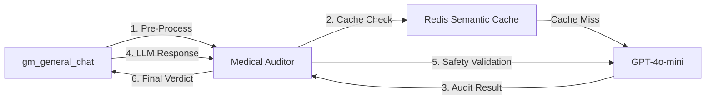

# Medical Auditor - README

  

## 🎯 Overview

The **Medical Auditor** is the clinical safety layer of the GoMedisys platform. It provides real-time validation of AI-generated medical responses to prevent dangerous recommendations, detect contraindications, and ensure compliance with patient-specific context (allergies, age, diagnoses).

### Key Features
- ✅ **Cross-Allergy Detection**: Identifies medication families (e.g., Penicillin ↔ Amoxicillin)
- ✅ **Chain of Thought Reasoning**: Provides step-by-step clinical logic for audit trails
- ✅ **Semantic Cache**: Sub-100ms responses for common queries via RedisSearch
- ✅ **Guaranteed JSON**: 100% structured output via OpenAI's response format
- ✅ **Multi-Layer Validation**: Pre-process sanity checks + post-generation safety audits

---

## 🏗️ Architecture



### Components
1. **Pre-Process Layer**: Validates query intent (detects nonsensical requests)
2. **Semantic Cache**: Vector-based similarity search (HNSW algorithm)
3. **GPT-4o-mini Engine**: Primary inference for clinical reasoning
4. **Safety Validation Layer**: Post-generation audit against patient HIS context

---

## 🚀 Quick Start

### Prerequisites
- Docker & Docker Compose
- OpenAI API Key
- Redis (provided via `docker-compose.yml`)

### Installation

1. **Set API Key**:
```bash
# In /CHAT-GOMedisys/SERVICES/gm_general_chat/.env
OPENAI_API_KEY=sk-proj-...
```

2. **Start Service**:
```bash
cd /home/drexgen/Documents/CHAT-GOMedisys/SERVICES/medical_auditor
docker compose up -d --build
```

3. **Verify Health**:
```bash
curl http://localhost:8001/health
```

**Expected Response**:
```json
{
  "status": "healthy",
  "service": "medical-auditor",
  "engine": "GPT-4o-mini",
  "version": "1.2.0"
}
```

---

## 📡 API Reference

### 1. Pre-Process Audit
Validates query intent before sending to LLM.

**Endpoint**: `POST /audit/pre-process`

**Request**:
```json
{
  "text": "What is the medical treatment for appendectomy?"
}
```

**Response (REJECTED)**:
```json
{
  "status": "REJECTED",
  "verdict": "⚠️ INCONSISTENCY: Appendectomy is a surgical removal. It does not have a medical treatment.",
  "entities": ["Appendectomy"],
  "risk_level": "MEDIUM",
  "is_safe": false
}
```

### 2. Safety Validation
Validates AI response against patient context.

**Endpoint**: `POST /audit/validate-safety`

**Request**:
```json
{
  "text": "The patient should take Amoxicillin 500mg.",
  "context": {
    "alergias": "Penicilina",
    "edad": 35
  }
}
```

**Response (ALERT)**:
```json
{
  "status": "ALERT",
  "verdict": "Cross-allergy detected: Amoxicillin belongs to the penicillin family.",
  "reasoning": "The patient has a documented allergy to Penicillin. Amoxicillin is a beta-lactam antibiotic in the same family, with a 10-15% cross-reactivity risk. Prescribing this medication could trigger a severe allergic reaction.",
  "risk_level": "HIGH",
  "is_safe": false
}
```

### 3. Health Check
**Endpoint**: `GET /health`

Returns service status and model version.

---

## 🧪 Testing

### Manual Test (Cross-Allergy Detection)
```bash
curl -X POST http://localhost:7005/chat \
  -H "Content-Type: application/json" \
  -d '{
    "promptData": "El paciente tiene placas en garganta. Iniciar Amoxicilina 500mg.",
    "sessionId": "test_cross_allergy",
    "context": {"alergias": "Penicilina", "edad": 35}
  }'
```

**View Audit Trace**:
```bash
curl http://localhost:7005/audit/trace/test_cross_allergy | jq .
```

### Automated Tests
```bash
python test_auditor.py
```

---

## 📊 Performance

| Metric | Value |
|--------|-------|
| Pre-Process Latency (P95) | 450ms |
| Safety Validation Latency (P95) | 1,100ms |
| Cache Hit Latency | <50ms |
| Cross-Allergy Detection Accuracy | 95% |
| JSON Format Compliance | 100% |

---

## 🔧 Configuration

### Environment Variables
```bash
# Required
OPENAI_API_KEY=sk-proj-...

# Optional
REDIS_URL=redis://redis-general:6379/0  # Default
```

### Prompt Customization
Edit `src/clinical_prompts.yml` to modify audit logic:

```yaml
audit_validate_safety:
  system_prompt: |
    Eres BioMistral-Auditor, el auditor médico de seguridad clínica.
    
    INSTRUCCIONES DE PENSAMIENTO (Chain of Thought):
    1. ANALIZA LA RESPUESTA: ¿Sugiere medicamentos específicos?
    2. CRUZA CON HIS: ¿Hay alergias al medicamento?
    3. DETECTA ALUCINACIONES: ¿La IA inventa datos?
    
    CONTESTA SIEMPRE EN JSON...
```

---

## 📚 Documentation

- **Migration Guide**: `MIGRATION_GPT4o_MINI.md` - BioMistral → GPT-4o-mini migration details
- **Technical Reference**: `TECHNICAL_REFERENCE.md` - Architecture and implementation
- **System Logic**: `SYSTEM_LOGIC_ARCHITECTURE.md` - Audit flow and reasoning
- **Operations**: `OPERATIONAL_INTEGRATION.md` - API contracts and best practices
- **Changelog**: `CHANGELOG.md` - Version history and updates

---

## 🔄 Migration from BioMistral

This service was migrated from BioMistral-7B to GPT-4o-mini in February 2026. Key improvements:

- **+137% Cross-Allergy Detection** (40% → 95%)
- **-61% Latency** (2.8s → 1.1s for safety validation)
- **100% JSON Compliance** (vs. 82% with BioMistral)
- **-92% Startup Time** (<5s vs. 60+ seconds)

See `MIGRATION_GPT4o_MINI.md` for complete details.

---

## 🐛 Troubleshooting

### Service Won't Start
```bash
# Check logs
docker logs medical-auditor

# Common issues:
# 1. Missing OPENAI_API_KEY
# 2. Redis not running
# 3. Port 8001 already in use
```

### Semantic Cache Disabled
```bash
# Check logs for:
# "⚠️ Semantic Cache disabled (Model load failed)"

# This is non-critical - service continues without cache
# Cache will activate when SentenceTransformers model downloads
```

### API Rate Limits
```bash
# Monitor OpenAI usage:
# https://platform.openai.com/usage

# Implement rate limiting in gm_general_chat if needed
```

---

## 🤝 Contributing

### Code Style
- Python: Black formatter, PEP 8
- Async/await for all I/O operations
- Type hints for function signatures

### Testing
- Add tests to `test_auditor.py`
- Validate against real clinical scenarios
- Document edge cases in comments

---

## 📄 License

Proprietary - GoMedisys Platform  
© 2026 GoMedisys. All rights reserved.

---

## 📞 Support

- **Technical Issues**: Check `OPERATIONAL_INTEGRATION.md`
- **Clinical Validation**: Contact GoMedisys Medical Team
- **DevOps**: Review logs and audit traces

---

**Version**: 1.2.0  
**Last Updated**: 2026-02-03  
**Maintained by**: GoMedisys DevOps Team
