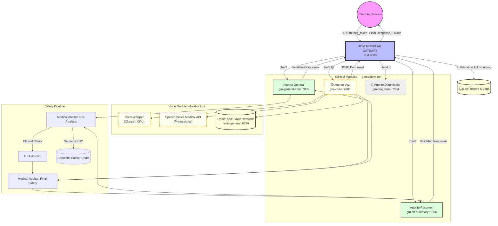

# GoMedisys System Architecture

```mermaid
graph TD
    %% Global Style
    classDef client fill:#f9f,stroke:#333,stroke-width:2px;
    classDef gateway fill:#bbf,stroke:#333,stroke-width:4px;
    classDef clinical fill:#dfd,stroke:#333,stroke-width:2px;
    classDef indev fill:#ffe,stroke:#f90,stroke-width:2px,stroke-dasharray: 4 2;
    classDef future fill:#eee,stroke:#999,stroke-dasharray: 5 5;
    classDef database fill:#ffd,stroke:#333,stroke-width:2px;

    %% Components
    USER((Client Application)):::client
    ADM[ADM MODULAR GATEWAY\nPort 8000]:::gateway
    DB[(SQLite: Tokens & Logs)]:::database

    subgraph MODULOS_CLINICOS [Clinical Modules — gomedisys-net]
        direction TB
        AG["Agente General\ngm-general-chat :7005"]:::clinical
        CS["Agente Resumen\ngm-ch-summary :7006"]:::clinical
        AV["🟡 Agente Voz\ngm-voice :7003"]:::indev
        AD["🔴 Agente Diagnóstico\ngm-diagnosis :7004"]:::future
    end

    subgraph VOICE_INFRA [Voice Module Infrastructure]
        direction LR
        WHISPER["faster-whisper\n(Classic / CPU)"]:::indev
        SPEECH["Speechmatics Medical API\n(Professional)"]:::indev
        REDIS_V[(Redis: db=1 voice sessions\nredis-general :6379)]:::database
    end

    subgraph AUDITORIA [Safety Pipeline]
        AUDIT_PRE[Medical Auditor: Pre-Analysis]
        LLM[GPT-4o-mini]
        AUDIT_POST[Medical Auditor: Final Safety]
        CACHE[(Semantic Cache: Redis)]
    end

    %% Flow
    USER -- "1. Auth: hcg_token" --> ADM
    ADM -- "2. Validation & Accounting" --> DB

    ADM -- "chat1" --> AG
    ADM -- "chat2" --> CS
    ADM -- "chat3 🟡" --> AV
    ADM -- "chat4 🔴" --> AD

    %% Audit flow
    AG --> AUDIT_PRE
    CS --> AUDIT_PRE
    AUDIT_PRE -- "Semantic Hit?" --> CACHE
    AUDIT_PRE -- "Clinical Check" --> LLM
    LLM --> AUDIT_POST
    AUDIT_POST --> AG
    AUDIT_POST --> CS

    %% Voice flow
    AV --> WHISPER
    AV --> SPEECH
    AV --> REDIS_V
    AV --> AUDIT_POST

    %% Return
    AG -- "Validated Response" --> ADM
    CS -- "Validated Response" --> ADM
    AV -- "SOAP Document" --> ADM
    ADM -- "Final Response + Trace" --> USER
```
