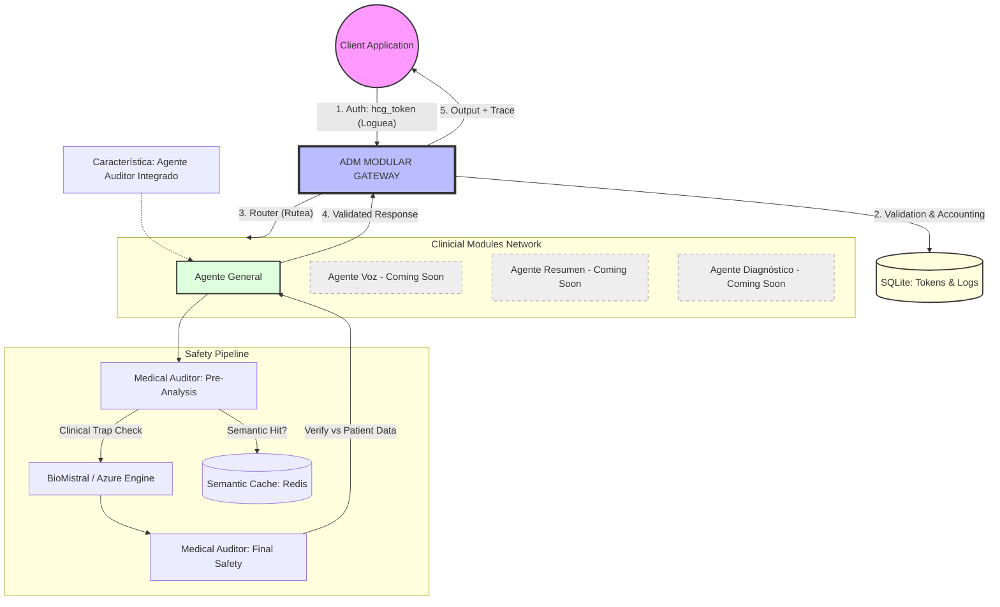

# GoMedisys System Architecture

```mermaid
graph TD
    %% Global Style
    classDef client fill:#f9f,stroke:#333,stroke-width:2px;
    classDef gateway fill:#bbf,stroke:#333,stroke-width:4px;
    classDef clinical fill:#dfd,stroke:#333,stroke-width:2px;
    classDef future fill:#eee,stroke:#999,stroke-dasharray: 5 5;
    classDef database fill:#ffd,stroke:#333,stroke-width:2px;

    %% Components
    USER((Client Application)):::client
    ADM[ADM MODULAR GATEWAY]:::gateway
    DB[(SQLite: Tokens & Logs)]:::database
    
    subgraph MODULOS_CLINICOS [Clinicial Modules Network]
        direction TB
        AG[Agente General]:::clinical
        AV[Agente Voz - Coming Soon]:::future
        AR[Agente Resumen - Coming Soon]:::future
        AD[Agente Diagnóstico - Coming Soon]:::future
    end

    subgraph AUDITORIA [Safety Pipeline]
        AUDIT_PRE[Medical Auditor: Pre-Analysis]
        LLM[BioMistral / Azure Engine]
        AUDIT_POST[Medical Auditor: Final Safety]
        CACHE[(Semantic Cache: Redis)]
    end

    %% Flow
    USER -- "1. Auth: hcg_token (Loguea)" --> ADM
    ADM -- "2. Validation & Accounting" --> DB
    
    ADM -- "3. Router (Rutea)" --> MODULOS_CLINICOS
    
    %% Internal Audit Flow for General Agent
    AG --> AUDIT_PRE
    AUDIT_PRE -- "Semantic Hit?" --> CACHE
    AUDIT_PRE -- "Clinical Trap Check" --> LLM
    LLM --> AUDIT_POST
    AUDIT_POST -- "Verify vs Patient Data" --> AG
    
    %% Return Final Data
    AG -- "4. Validated Response" --> ADM
    ADM -- "5. Output + Trace" --> USER

    %% Annotations
    note1[Característica: Agente Auditor Integrado]
    note1 -.-> AG
```
