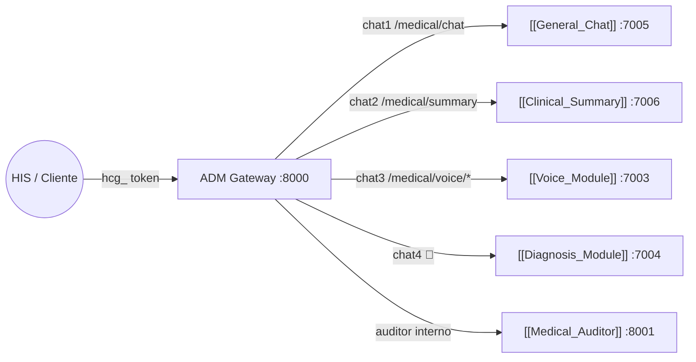

# 🔐 ADM_MODULAR — API Gateway Central
#módulo/gateway #estado/activo #seguridad/RBAC

> **Rol**: El "Portero" del ecosistema. Único punto de entrada público. Gestiona autenticación, autorización, enrutamiento y contabilidad de tokens LLM para todos los microservicios clínicos.

## 📌 Rol en el Ecosistema

---

## 🔑 Seguridad — Autenticación y Autorización

### API Keys médicas (Bearer hcg_)
- **Formato**: `hcg_` + `secrets.token_hex(16)` — entropía de 128 bits
- **Header**: `Authorization: Bearer hcg_xxx`
- **Almacenamiento**: plain en `healthcare_gateway.db` (tabla `tokens`)
- **Validación**: en cada request, lookup directo en SQLite

### Control de Acceso (RBAC)
| Rol | Acceso |
|---|---|
| `admin` | Crear/revocar usuarios y tokens, ver logs, stats |
| `user` | Endpoints médicos: `/medical/chat`, `/medical/summary`, `/medical/voice/*` |
| `monitor` | Solo lectura: `/monitor/stats/*` |

### Admin JWT
- **Endpoint**: `POST /auth/login` → devuelve JWT (HS256, 24h)
- **Header**: `Authorization: Bearer <jwt>`
- **Uso**: gestión admin — no para operaciones clínicas

---

## 🗄️ Base de Datos (SQLite)

**Archivo**: `data/healthcare_gateway.db` (volumen Docker `gateway_data`)

| Tabla | Descripción |
|---|---|
| `users` | Usuarios del sistema (admin, doctor, monitor) |
| `tokens` | Tokens `hcg_` activos/revocados |
| `sessions` | Sesiones de chat con session_id |
| `api_requests` | Log de cada request: tokens consumidos, endpoint, tool_used, costo estimado |

---

## 🔀 Endpoints Proxy

### Operaciones médicas (token hcg_)
| Método | Ruta | Módulo destino |
|---|---|---|
| POST | `/medical/chat` | `healthcare-chat-api:7005` |
| POST | `/medical/summary` | `gm-ch-summary:7006` |
| POST | `/medical/voice/start` | `gm-voice:7003` |
| POST | `/medical/voice/chunk` | `gm-voice:7003` — multipart, devuelve 202 |
| GET | `/medical/voice/status/{id}` | `gm-voice:7003` — polling SOAP |
| POST | `/medical/voice/end` | `gm-voice:7003` — consolida documento final |

### Administración (JWT admin)
| Método | Ruta | Descripción |
|---|---|---|
| GET/POST | `/admin/users` | Gestión de usuarios |
| GET/POST/DELETE | `/admin/tokens` | Gestión de tokens hcg_ |
| GET | `/monitor/stats/system` | Stats globales (requests, tokens, tools) |
| GET | `/monitor/stats/token/{id}` | Stats por token |

---

## ⚙️ Stack Tecnológico

| Tecnología | Uso |
|---|---|
| **FastAPI** | Framework ASGI |
| **SQLAlchemy 2.0** | ORM SQLite — `func`, `desc` importados de `sqlalchemy` |
| **httpx** | Cliente HTTP async para proxy |
| **python-jose** | JWT HS256 |
| **passlib[bcrypt]** | Hash de contraseñas admin |

> [!NOTE]
> Código en `SERVICES/ADM_MODULAR/`. Se levanta con `--reload` (bind mount en compose).
> DB persiste en volumen Docker `gateway_data:/app/data`.

---

## 🔗 Notas Relacionadas
- [[Medical_Auditor]] — Auditoría clínica interna (port 8001)
- [[General_Chat]] — Módulo `chat1` (:7005)
- [[Clinical_Summary]] — Módulo `chat2` (:7006)
- [[Voice_Module]] — Módulo `chat3` (:7003)
- [[Index]] — Volver al mapa de contenido
