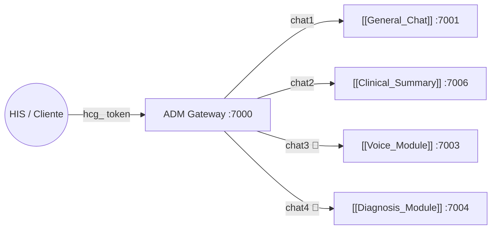

# 🔐 ADM_MODULAR — API Gateway Central
#módulo/gateway #estado/activo #seguridad/RBAC

> **Rol**: El "Portero" (Portero) del ecosistema. Es el único punto de entrada público. Gestiona autenticación, autorización, enrutamiento y contabilidad de tokens LLM para todos los microservicios clínicos.

## 📌 Rol en el Ecosistema



---

## 🔑 2. Seguridad — Autenticación y Autorización

### 2.1 API Keys (AuthN)
- **Formato**: `hcg_` + `secrets.token_urlsafe(32)` = **256 bits de entropía**
- **Tipo**: Bearer Token en cabecera `Authorization`
- **Almacenamiento**: Hashed en `modular_gateway.db` (tabla `Token`)

### 2.2 Control de Acceso (AuthZ — RBAC)
| Rol | Permisos |
|---|---|
| `admin` | Acceso total: crear/revocar tokens, ver logs, panel admin |
| `user` | Usar los endpoints de proxy `/proxy/{module}` |
| `monitor` | Solo lectura: ver estadísticas de consumo |

- **Implementación**: Dependencia FastAPI `validate_api_key` → consulta en tiempo real a la DB en **cada** petición.

### 2.3 Sesiones de Admin (JWT)
- **Protocolo**: JSON Web Tokens (JWT)
- **Algoritmo**: `HS256` (HMAC-SHA256)
- **Duración**: **24 horas** (`ACCESS_TOKEN_EXPIRE_MINUTES = 1440`)
- **Hashing de contraseñas**: `bcrypt` vía `passlib` — protección contra rainbow tables

---

## 🗄️ 3. Esquema de Base de Datos (SQLite)

**Archivo**: `modular_gateway.db`

### Tabla: `User`
| Campo | Tipo | Descripción |
|---|---|---|
| `id` | INT | PK |
| `username` | STR | Nombre de usuario |
| `hashed_password` | STR | bcrypt hash |
| `role` | ENUM | `admin`, `user`, `monitor` |

### Tabla: `Token`
| Campo | Tipo | Descripción |
|---|---|---|
| `id` | INT | PK |
| `token_hash` | STR | Hash del `hcg_` token |
| `user_id` | FK | Dueño del token |
| `total_tokens_consumed` | INT | Contador acumulado de tokens LLM |
| `is_active` | BOOL | Para revocar el acceso |

### Tabla: `APILog`
| Campo | Tipo | Descripción |
|---|---|---|
| `token_id` | FK | Qué token hizo la petición |
| `endpoint` | STR | Módulo de destino (ej: `chat1`) |
| `prompt_tokens` | INT | Tokens de entrada al LLM |
| `completion_tokens` | INT | Tokens de salida del LLM |
| `total_tokens` | INT | Total |
| `timestamp` | DATETIME | Momento de la petición |

---

## 🔀 4. Registro de Módulos (Module Registry)

```python
MODULES = {
    "chat1": "http://gm-general-chat:7001",  # [[General_Chat]]
    "chat2": "http://gm-ch-summary:7006",    # [[Clinical_Summary]]
    "chat3": "http://gm-voice:7003",          # [[Voice_Module]] 🟡 EN DESARROLLO
    "chat4": "http://gm-diagnosis:7004",      # [[Diagnosis_Module]] 🔴 PENDIENTE
}
```
> Configurables vía Variables de Entorno para facilitar el despliegue.

---

## 🎤 5. Endpoints de Voz (chat3 — [[Voice_Module]])

Añadidos en rama `gm_voice_dev`. Proxy hacia `gm-voice:7003`.

| Método | Ruta | Auth | Descripción |
|---|---|---|---|
| POST | `/medical/voice/chunk` | Bearer | Recibe chunk de audio (multipart). Devuelve 202 inmediatamente. |
| POST | `/medical/voice/end` | Bearer | Cierre de consulta → documento SOAP consolidado. |
| GET | `/medical/voice/status/{session_id}` | Bearer | Polling del documento en construcción. |

**Billing diferenciado por tier:**
El campo `tool_used` en `api_requests` registra `voice_classic` o `voice_professional` por cada llamada, permitiendo facturación separada por tier.

**Request `/medical/voice/chunk`:**
```
Content-Type: multipart/form-data
Authorization: Bearer hcg_xxx

audio        = <archivo .mp3 / .wav>
session_id   = "voz_abc123"
chunk_number = 1
tier         = "classic" | "professional"
```

---

## ⚙️ 5. Stack Tecnológico

| Tecnología | Uso |
|---|---|
| **FastAPI** | Framework asíncrono (ASGI) |
| **SQLAlchemy 2.0** | ORM para SQLite |
| **httpx** | Cliente HTTP async para el proxy |
| **python-jose** | Generación y validación de JWT |
| **passlib[bcrypt]** | Hashing de contraseñas |

---

## 🔗 Notas Relacionadas
- [[Medical_Auditor]] — Es llamado por los módulos que recibe el gateway
- [[General_Chat]] — Módulo `chat1`
- [[Clinical_Summary]] — Módulo `chat2`
