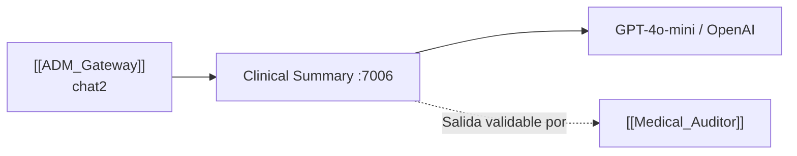
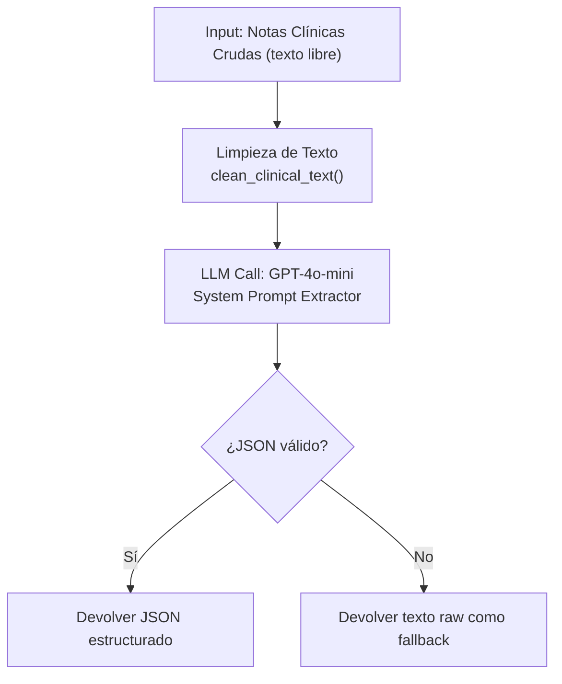

# 📋 Clinical_Summary — Motor de Extracción de Historias Clínicas
#módulo/summary #estado/activo #llm/openai

> **Rol**: El "Extractor" del ecosistema. Recibe notas clínicas desestructuradas (texto libre copiado de HIS, múltiples notas de evolución) y devuelve un **JSON estructurado** con resumen, alertas y entidades médicas extraídas.

## 📌 Integración en el Ecosistema



---

## 🔄 2. Flujo de Procesamiento



---

## 🧹 3. Limpieza de Texto — `clean_clinical_text()`
Los textos copiados de HIS suelen tener artefactos que rompen el parser JSON. Esta función:
1. Elimina `\r`, `\n` escapados (literales `\\r`, `\\n`)
2. Elimina saltos de línea reales
3. Colapsa espacios múltiples en uno solo
4. Filtra todos los caracteres no imprimibles

---

## 📦 4. Output JSON Estructurado

El LLM tiene instrucción estricta de responder **SOLO** con JSON válido:

```json
{
  "resumen_clinico": "Párrafo de ~1000 palabras en español técnico profesional resumiendo diagnóstico, evolución, tratamientos, exámenes y recomendaciones...",
  
  "auditor_alerts": [
    "ALERTA: Discrepancia de género entre nota 1 y nota 3",
    "ALERTA: Hipotensión severa registrada — PA: 80/50 mmHg"
  ],
  
  "medical_entities_extracted": {
    "diagnosticos": ["Diabetes Mellitus tipo 2", "Hipertensión arterial"],
    "tratamientos": ["Metformina 850mg", "Enalapril 10mg"],
    "alergias": ["Penicilina"],
    "signos_criticos": ["Taquicardia sinusal 120bpm"]
  }
}
```

### Campos del Output
| Campo | Descripción |
|---|---|
| `resumen_clinico` | ~1000 palabras. Para otros médicos. Español técnico. Sin HTML. |
| `auditor_alerts` | Discrepancias (edad/género), alertas críticas de severidad. Array vacío si no hay alertas. |
| `diagnosticos` | Lista de diagnósticos extraídos |
| `tratamientos` | Lista de tratamientos y medicamentos |
| `alergias` | Alergias identificadas en las notas |
| `signos_criticos` | Signos vitales o hallazgos de criticidad |

---

## ⚙️ 5. Configuración LLM
- **Modelo**: `GPT-4o-mini` (configurable por env `OPENAI_MODEL`)
- **Temperature**: `0.1` — Máximo determinismo, mínima creatividad (extracción de datos, no generación)
- **Session ID**: `ch_` + UUID de 12 chars (Ej: `ch_a1b2c3d4e5f6`)

---

## 🔄 6. Tracking de Consumo
El servicio devuelve el uso de tokens para que el [[ADM_Gateway]] pueda registrarlo en `APILog`:
```json
{
  "usage": {
    "prompt_tokens": 2400,
    "completion_tokens": 850,
    "total_tokens": 3250
  }
}
```

---

## ⚙️ 7. Stack Tecnológico
| Tecnología | Uso |
|---|---|
| **FastAPI** | Framework asíncrono |
| **OpenAI Python SDK** | Llamadas a GPT-4o-mini |

---

## 🔗 Notas Relacionadas
- [[ADM_Gateway]] — Recibe la petición como módulo `chat2`
- [[Medical_Auditor]] — Compatible para validación adicional de la salida
