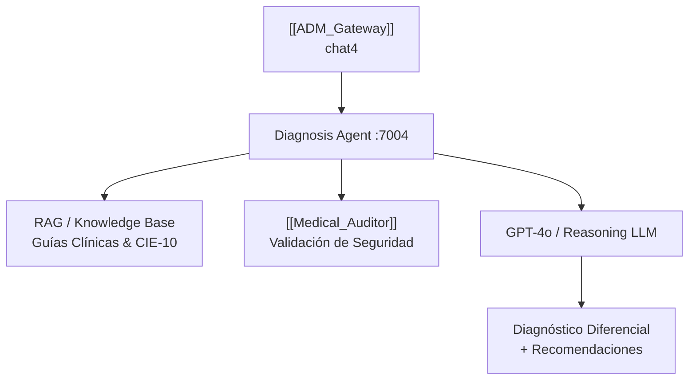

# 🔬 Diagnosis_Module — Agente de Soporte Diagnóstico
#módulo/diagnosis #estado/pendiente #modulo/futuro

> **Rol**: Módulo `chat4` en el [[ADM_Gateway]]. Su función prevista es asistir al médico en el proceso diagnóstico con razonamiento clínico diferencial basado en síntomas, historial y resultados de laboratorio.

---

## 🔴 Estado: PENDIENTE DE IMPLEMENTACIÓN

> [!WARNING]
> Este módulo está registrado en el Registry del [[ADM_Gateway]] como `chat4` en `http://gm-diagnosis:7004`, pero su implementación está **pendiente**.

---

## 📐 Arquitectura Prevista



---

## 📋 Funcionalidades Previstas

| Funcionalidad | Descripción |
|---|---|
| **Diagnóstico Diferencial** | Lista ordenada por probabilidad de diagnósticos posibles |
| **RAG Médico** | Búsqueda en guías clínicas (GPC), CIE-10, Vademécum |
| **CoT Clínico** | Chain-of-Thought razonamiento paso a paso documentado |
| **Integración Auditor** | Todo output pasa por [[Medical_Auditor]] antes de llegar al médico |
| **Contexto HIS** | Usa historial completo del paciente (diagnósticos previos, alergias) |

---

## 🗒️ Notas de Diseño

```
%% TODO: Definir fuente del Knowledge Base (RAG) — ¿Vademécum propio? ¿PubMed API? %%
%% TODO: Evaluar modelo: GPT-4o para razonamiento complejo vs. gpt-4o-mini para velocidad %%
%% TODO: Definir formato de output para integrar con pantalla del médico en HIS %%
%% TODO: Considerar alertas de medicación cruzada con el módulo Auditor %%
```

---

## 🔗 Notas Relacionadas
- [[ADM_Gateway]] — Registrado como módulo `chat4`
- [[Medical_Auditor]] — Para validar el diagnóstico diferencial
- [[General_Chat]] — Módulo complementario de interacción general
- [[Index]] — Volver al mapa de contenido
