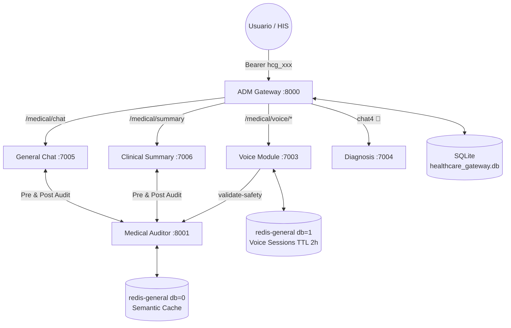
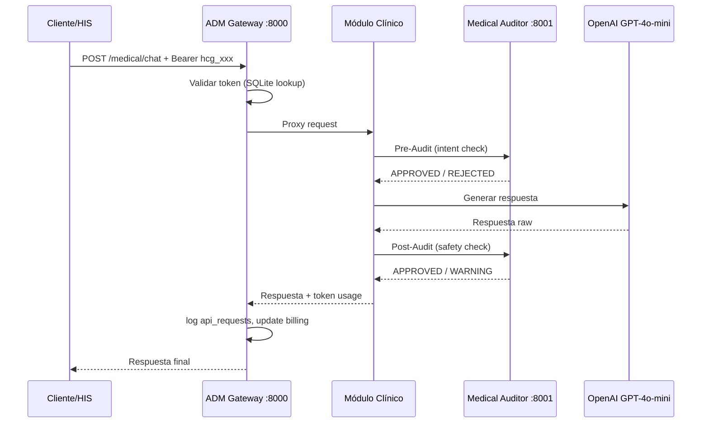

# 🗺️ Map of Content: GoMedisys Ecosystem
#tipo/MOC #estado/activo

Bienvenido al vault del **GoMedisys Modular Ecosystem**. Documenta la arquitectura de microservicios clínicos desplegados desde `SERVICES/docker-compose.yml`.

## 🏁 NÚCLEO DEL ECOSISTEMA
| Módulo | Puerto | Rol |
|---|---|---|
| [[ADM_Gateway]] | `:8000` | Portero Central — Auth, Routing, Billing |
| [[Medical_Auditor]] | `:8001` | Seguridad Clínica — Pre/Post Audit |

## 💬 MÓDULOS CLÍNICOS
| Módulo | Puerto | Rol |
|---|---|---|
| [[General_Chat]] | `:7005` | Agente de Interacción Clínica |
| [[Clinical_Summary]] | `:7006` | Motor de Extracción de Historias Clínicas |
| [[Voice_Module]] | `:7003` | 🟡 Transcripción Clínica Progresiva por Chunks |

## 🛠️ MÓDULOS PENDIENTES
| Módulo | Puerto | Estado |
|---|---|---|
| [[Diagnosis_Module]] | `:7004` | 🔴 Pendiente — Agente de Soporte Diagnóstico |

## 📐 ARQUITECTURA GENERAL



## 🚀 Levantar el ecosistema

```bash
docker network create gomedisys-net   # una sola vez
cd SERVICES/
docker compose up -d --build
```

## 🔗 FLUJO DE UNA PETICIÓN CLÍNICA



> [!NOTE]
> Cada módulo tiene su propia nota. Usa los links `[[...]]` para navegar.
