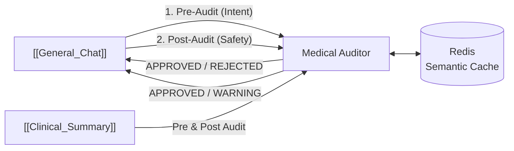

# 🧠 Medical_Auditor — Cerebro de Seguridad Clínica
#módulo/auditor #estado/activo #seguridad/clinica

> **Rol**: El "Juez" del ecosistema. Opera en dos momentos clave de cada petición: **antes** de que el LLM genere una respuesta (Intent Audit) y **después** (Risk/Safety Audit). Su objetivo es filtrar errores médicos, alucinaciones y peligros clínicos.

## 📌 Integración en el Ecosistema



---

## 📐 2. Jerarquía de Auditoría — 3 Capas

### 🔵 Capa 1: Vector Hit Layer (Memoria Semántica)
> Objetivo: Respuesta instantánea para consultas ya vistas antes

1. **Embedding**: El texto entrante se convierte en un vector de **384 dimensiones** (modelo `sentence-transformers`)
2. **KNN Search**: Búsqueda K-Nearest Neighbors en **Redis** con índice vectorial
3. **Threshold Gate**:
   - Distancia `< 0.05` (Similitud `> 95%`): Se devuelve el `status` y `verdict` cacheados **sin llamar al LLM**
   - Sin hit: La petición pasa a la Capa 2

### 🟡 Capa 2: Intent Audit (Filtro Pre-Generación)
> Objetivo: Detectar preguntas absurdas o "trampas" antes de gastar tokens LLM

- **Ejecutor**: **GPT-4o-mini**
- **Lógica**: Distingue entre entidades **procedurales** vs. **patológicas**
- **Ejemplo de trampa detectada**: `"¿Qué medicamento tomo para la colecistectomía?"` → La colecistectomía es una cirugía (procedimiento), no una enfermedad. El auditor **RECHAZA** y devuelve una advertencia clínica.
- **Persistencia**: Los veredictos del LLM se guardan en la caché semántica de Redis para acelerar futuras consultas idénticas.

### 🔴 Capa 3: Risk Audit — Safety Validation (Juez Post-Generación)
> Objetivo: Validar que la respuesta generada no sea peligrosa para el paciente

- **Inputs**: Respuesta generada por el LLM + Contexto del paciente del HIS:
  - Género, Edad, Diagnósticos, Alergias
- **Razonamiento (Chain of Thought)**: GPT-4o-mini evalúa:
  | Riesgo | Ejemplo |
  |---|---|
  | **Alergia cruzada** | Penicilina → Amoxicilina (ambas beta-lactámicas) |
  | **Contraindicación** | Ibuprofeno en paciente con úlcera gástrica |
  | **Riesgo por edad** | Aspirina en niños (Síndrome de Reye) |
  | **Alucinación** | Consejo médico sin sentido en el contexto del HIS |
- **Explicabilidad**: El campo `reasoning` documenta el razonamiento clínico paso a paso (para trazabilidad en la historia clínica).

---

## ⚡ 3. Patrón Asíncrono
- **Async vLLM Calls**: `async/await` en todas las llamadas a OpenAI → permite manejar **cientos de auditorías concurrentes** sin bloquear.
- **Async Redis IO**: Búsquedas y escrituras en caché no bloqueantes.

---

## 🧬 4. Evolución del Conocimiento
El "cerebro" del auditor evoluciona editando `clinical_prompts.yml`:
```yaml
# Ejemplo de "trampa" configurable en el YAML
traps:
  - trigger: "colecistectomía"
    type: "procedimiento_quirurgico"
    warning: "La colecistectomía es una cirugía, no una condición patológica tratable."
```
> Cambiar este archivo actualiza la lógica clínica en **toda la plataforma** sin tocar el código.

---

## ⚙️ 5. Stack Tecnológico
| Tecnología | Uso |
|---|---|
| **FastAPI** | Framework asíncrono |
| **Redis** | Caché semántica vectorial (KNN) |
| **sentence-transformers** | Generación de embeddings (384 dims) |
| **GPT-4o-mini** | Razonamiento clínico (Intent + Risk) |

---

## 🔗 Notas Relacionadas
- [[ADM_Gateway]] — Enruta las peticiones a los módulos que usan el auditor
- [[General_Chat]] — Llama al auditor en los pasos 2 y 4 de su pipeline
- [[Clinical_Summary]] — También valida su salida con el auditor
