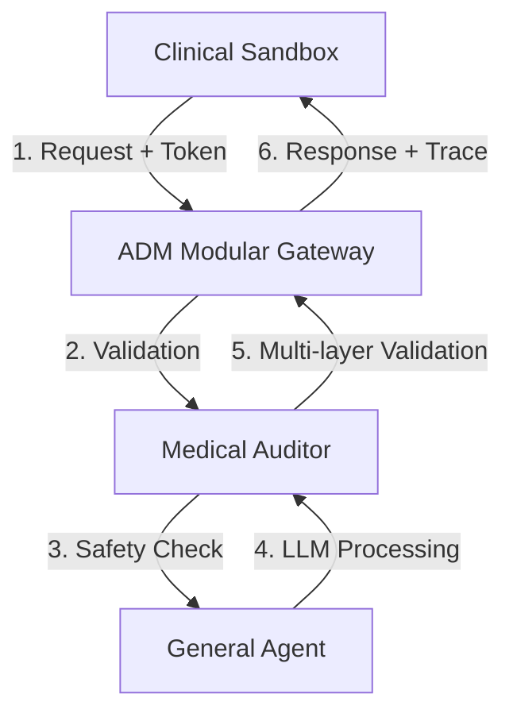

# GoMedisys: Clinical Intelligence System Walkthrough

Este documento detalla el funcionamiento técnico y la arquitectura del ecosistema **GoMedisys**. 

 

---

## 1. Arquitectura del Sistema

El sistema está diseñado bajo una arquitectura de microservicios orquestada por Docker, donde cada componente cumple un rol crítico en la cadena de procesamiento médico.

### Diagrama de Flujo

---

## 2. Componentes Principales

### 🤖 Clinical Sandbox (Frontend)
*   **Tecnologías:** React + Vite.
*   **Propósito:** Interfaz de pruebas de alto nivel para médicos y desarrolladores.
*   **Funcionalidades Clave:**
    *   **Simulación de HIS:** Permite inyectar contexto real de paciente (edad, género, diagnóstico previo).
    *   **Inspector Técnico:** Visualización en tiempo real del "Audit Trace" (trazabilidad de seguridad).
    *   **Modo Inyección:** Testeo de vulnerabilidades y robustez del prompt.

### 🛡️ Medical Auditor (Capa de Seguridad)
*   **Tecnologías:** Python + FastAPI + GPT-4o-mini (OpenAI API).
*   **Propósito:** Garantizar que la IA no entregue respuestas peligrosas o fuera de contexto clínico.
*   **Mecanismos:**
    *   **Semantic Cache (Redis):** Si una pregunta similar ya fue validada, responde instantáneamente ahorrando tokens.
    *   **Refuerzo de Contexto:** Valida la respuesta de la IA contra los datos del paciente (HIS).
    *   **Chain of Thought Reasoning:** GPT-4o-mini proporciona razonamiento explícito paso a paso para detección de alergias cruzadas y contraindicaciones.
*   **Migración Reciente (Feb 2026):** El auditor fue migrado de BioMistral-7B a GPT-4o-mini para mejorar la precisión en detección de alergias cruzadas (ej. Penicilina → Amoxicilina). Ver `medical_auditor/MIGRATION_GPT4o_MINI.md` para detalles técnicos.

### 🚪 ADM Modular (Gateway)
*   **Tecnologías:** FastAPI.
*   **Propósito:** Punto de entrada único, gestión de registros y control de costes.
*   **Funcionalidades:**
    *   **Auth:** Validación de `hcg_tokens`.
    *   **Accountability:** Registro exacto de cuántos tokens consume cada "clínica" o "usuario".

### 💬 GM General Chat (Agente Central)
*   **Tecnologías:** Python (LangChain/LangGraph).
*   **Propósito:** Motor cognitivo que interactúa con los modelos de lenguaje (OpenAI / Azure).

---

## 3. Walkthrough Operacional (Visual)

A continuación, se describen los pasos capturados en la sesión de auditoría actual.

### Paso 1: Interacción Clínica y Renderizado
Cuando un usuario envía una consulta médica, el sistema no solo responde texto; utiliza un renderizado avanzado de **Markdown** para estructurar la información (diagnósticos diferenciales, recomendaciones, riesgos).

> **Detalle Técnico:** El Sandbox envía el mensaje envuelto en un `trace_id` que permite seguirlo por todos los servicios.

### Paso 2: El Inspector de Auditoría (Audit Trace)
En el panel derecho del Sandbox, podemos ver exactamente qué pasó "bajo el capó":
1.  `INPUT_RECEIVED`: Se capturan los datos puros.
2.  `CONTEXT_INJECTED`: Se añade la información del paciente.
3.  `SAFETY_VALIDATED`: El Auditor aprueba el envío al LLM.

### Paso 3: Gestión del Gateway (ADM)
La vista de administración permite ver el "latido" del sistema:
*   **Monitor de Consumo:** Muestra el coste de cada interacción.
*   **Registro de Tokens:** Gestión de usuarios que pueden acceder a la API.

---

## 4. Pruebas de Seguridad (Anti-Injection)

Una de las capacidades más potentes es el **Prompt Injection Simulator**. 
Si un usuario intenta "romper" a la IA (ej. preguntando cómo fabricar sustancias no médicas o saltarse restricciones), el **Medical Auditor** detecta la anomalía en el flujo de trazo y bloquea o encapsula la respuesta dentro de etiquetas de seguridad XML para neutralizar el intento.

---

## 5. Próximos Pasos (Hoja de Ruta)
*   [ ] Integración de Agente de Voz (Audio-to-Med).
*   [ ] Dashboard de Eficiencia Hub detallado.
*   [ ] Exportación de reportes de auditoría en PDF.

---
*Este documento es autogenerado por el sistema de asistencia GoMedisys v2.0.*
