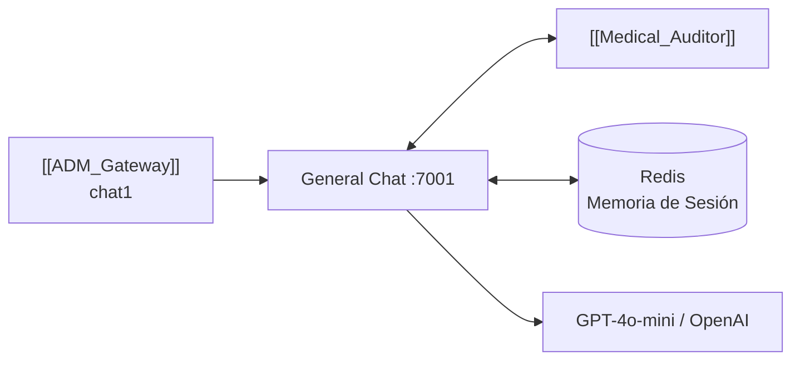
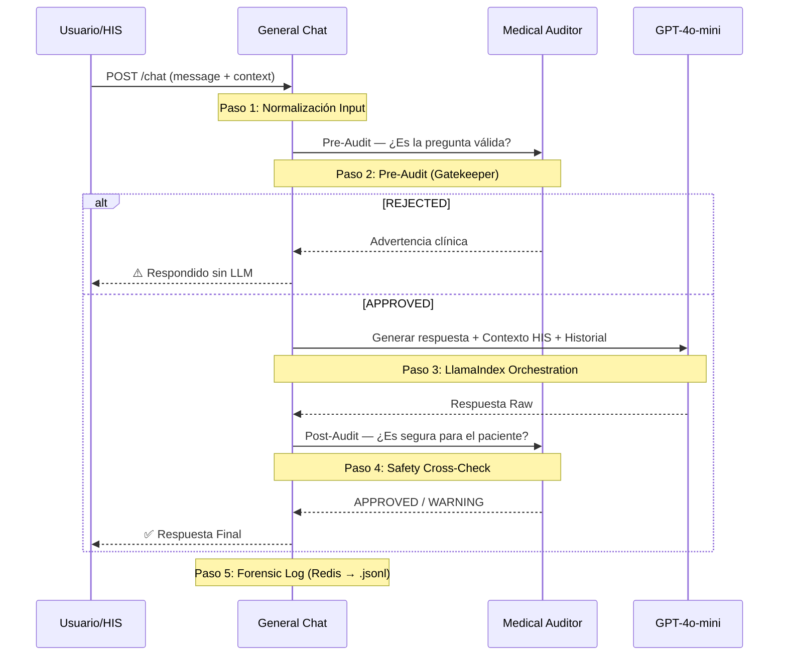

# 💬 General_Chat — Agente Clínico de Interacción
#módulo/chat #estado/activo #llm/llamaindex

> **Rol**: El módulo de conversación médica especializada. Actúa como un **especialista clínico** que consume el contexto del HIS (Historia Clínica Informatizada) del paciente y responde a consultas médicas pasando por un **pipeline de seguridad de 5 pasos**.

## 📌 Integración en el Ecosistema

---

## 🔄 2. Pipeline Clínico de 5 Pasos

Cada petición al chat atraviesa esta secuencia **determinista** antes de devolver una respuesta al paciente.

### Paso 1: Normalización de Input
- Usa **Pydantic Validation Aliases** para compatibilidad con clientes legacy
  - `promptData` → `message`
  - `sessionId` → `session`
- Guarda evento `INPUT_RECEIVED` en la traza de sesión

### Paso 2: Pre-Audit — El Gatekeeper
- Llama al [[Medical_Auditor]] con la pregunta del usuario
- Si `status == REJECTED` → bypasea el LLM y devuelve directamente la advertencia clínica
- **Impacto**: Ahorra costes de tokens y previene respuestas peligrosas

### Paso 3: LlamaIndex Orchestration — El Razonamiento
- Inicializa un `OpenAIAgent` o `ReActAgent` (LlamaIndex)
- **Prompt**: Carga el prompt especializado del `PromptManager` (Pediátrico, Urgencias, General…)
- **Memoria**: Fusiona el mensaje actual con los **últimos 10 intercambios** de Redis (sliding window)
- **Contexto HIS**: Inyecta en el system prompt: `Género`, `Edad`, `Diagnósticos`, `Alergias`

### Paso 4: Safety Cross-Check — El Juez
- El output bruto del LLM va de vuelta al [[Medical_Auditor]]
- Se evalúa contra el contexto del paciente (alergias, diagnósticos)
- Se registra como `AUDITOR_SAFETY_VALIDATION` en la traza

### Paso 5: Serving & Log Forense
- La respuesta se envía al usuario
- La traza completa (timings + datos raw) se mueve de Redis al archivo persistente `audit_log.jsonl`

---

## 🧠 3. Memoria Dinámica (Sliding Window)
- **Almacenamiento**: `Redis HSET` con objetos `ConversationMemory` serializados
- **Auto-poda**: Trunca el historial automáticamente para no superar los límites del context window del LLM

---

## 🌍 4. Inteligencia de Idioma
- **Detección**: Función dedicada identifica si el input es Español o Inglés
- **Restricción**: Fuerza al LLM a responder **en el idioma detectado**, independientemente del idioma base del prompt médico

---

## 📂 5. PromptManager
- Carga prompts clínicos especializados desde `prompts.yml`
- Modos disponibles: `General`, `Pediátrico`, `Urgencias`, `Oncológico`, etc.
- Permite actualizar la lógica de conversación sin tocar el código

---

## ⚙️ 6. Stack Tecnológico
| Tecnología | Uso |
|---|---|
| **FastAPI** | Framework asíncrono (ASGI) |
| **LlamaIndex** | Orquestación del agente (OpenAIAgent / ReActAgent) |
| **OpenAI GPT-4o-mini** | Modelo LLM base |
| **Redis** | Memoria de sesión y caché |

---

## 🔗 Notas Relacionadas
- [[ADM_Gateway]] — Recibe la petición como módulo `chat1`
- [[Medical_Auditor]] — Llamado en los pasos 2 y 4 del pipeline
- [[Clinical_Summary]] — Módulo hermano para historias clínicas (chat2)
