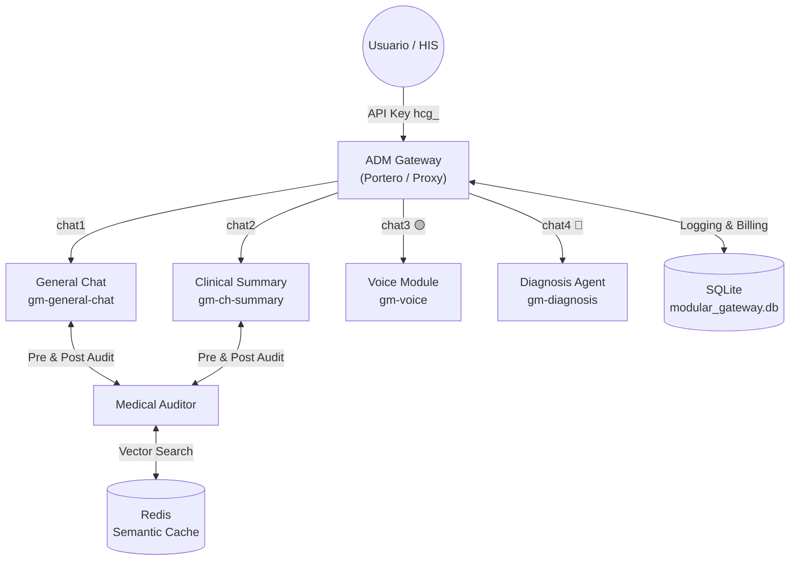
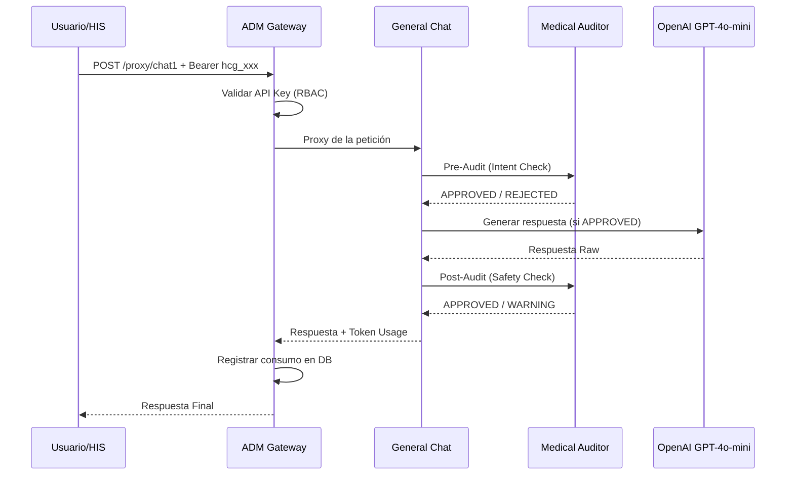

# 🗺️ Map of Content: GM_MODULAR_ECOSYSTEM
#tipo/MOC #estado/activo

Bienvenido al vault del **GM Modular Ecosystem**. Este vault documenta la arquitectura de microservicios clínicos de GoMedisys.

## 🏁 NÚCLEO DEL ECOSISTEMA
| Módulo | Rol |
|---|---|
| [[ADM_Gateway]] | Portero Central — Autenticación, Routing y Contabilidad de Tokens |
| [[Medical_Auditor]] | Cerebro de Seguridad — Prevención de Errores Clínicos |

## 💬 MÓDULOS CLÍNICOS
| Módulo | Rol |
|---|---|
| [[General_Chat]] | Agente de Interacción Clínica con Pipeline de 5 Pasos |
| [[Clinical_Summary]] | Motor de Extracción Estructurada de Historias Clínicas |

## 🚧 MÓDULOS EN DESARROLLO
| Módulo | Estado |
|---|---|
| [[Voice_Module]] | 🟡 En Desarrollo — Transcripción Clínica Progresiva por Chunks |

## 🛠️ MÓDULOS PENDIENTES
| Módulo | Estado |
|---|---|
| [[Diagnosis_Module]] | 🔴 Pendiente — Agente de Soporte Diagnóstico |

## 📐 ARQUITECTURA GENERAL

## 🔗 FLUJO DE UNA PETICIÓN COMPLETA

> [!NOTE]
> Cada módulo tiene su propia nota de documentación detallada. Usa los links `[[...]]` para navegar entre ellos.
