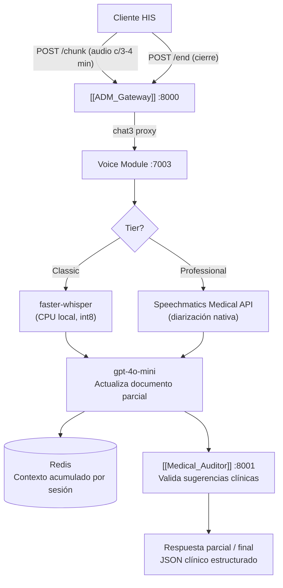

# 🎤 Voice_Module — Transcripción Clínica Progresiva
#módulo/voice #estado/en-desarrollo #modulo/chat3

> **Rol**: Módulo `chat3` en el [[ADM_Gateway]]. Recibe chunks de audio de una consulta médica y construye progresivamente un documento clínico estructurado en pantalla mientras el médico atiende al paciente.

---

## 🟡 Estado: EN DESARROLLO — Implementado, pendiente pruebas con usuarios reales

> [!NOTE]
> Rama activa: `gm_voice_dev`. Servicio implementado y probado localmente con audio sintético (OpenAI TTS). La rama permanece abierta hasta completar pruebas con médicos reales y audio de consultas auténticas.

**Lo que está hecho:**
- ✅ Endpoints `/chunk`, `/end`, `/status`, `/health`
- ✅ Tier Classic: faster-whisper CPU (int8, modelo `small`)
- ✅ Tier Professional: Speechmatics Medical API (estructura lista, requiere API key)
- ✅ Estado de sesión en Redis (`redis-voice`, TTL 2h)
- ✅ Actualización incremental del documento con GPT-4o-mini
- ✅ Consolidación final con sugerencias clínicas
- ✅ Integración con [[Medical_Auditor]] (fail-open)
- ✅ Endpoints proxy en [[ADM_Gateway]]: `/medical/voice/chunk`, `/medical/voice/end`, `/medical/voice/status/{id}`
- ✅ Billing diferenciado: `tool_used = "voice_classic"` / `"voice_professional"`

**Pendiente:**
- 🔲 Pruebas con audio real de consultas médicas en español
- 🔲 Evaluar modelo `medium` vs `small` en precisión de terminología clínica
- 🔲 Volumen de caché de HuggingFace en docker-compose (evitar re-descarga al rebuildar)

---

## 🎯 Propósito

Eliminar la carga administrativa del médico convirtiendo la consulta oral en un documento clínico estructurado de forma automática y progresiva. Para cuando termina la consulta, el documento está listo para revisar y firmar.

---

## 📐 Arquitectura



---

## 📋 Flujo de Consulta

```
1. Médico inicia consulta → HIS abre sesión (session_id)
2. Cada 3-4 min → HIS envía chunk de audio + session_id + tier
3. Servidor transcribe → acumula en Redis → LLM actualiza documento
4. Médico ve el documento construirse en pantalla en tiempo real
5. Consulta termina → HIS envía POST /end
6. Servidor consolida → documento final + sugerencias validadas por Auditor
```

---

## 📄 Documento Clínico de Salida

| Sección | Origen | Tipo |
|---|---|---|
| Motivo de consulta | Transcripción | Extracción fiel |
| Enfermedad actual | Transcripción | Extracción fiel |
| Signos vitales | Transcripción (médico los dicta) | Extracción fiel |
| Antecedentes | Transcripción | Extracción fiel |
| Medicación actual | Transcripción | Extracción fiel |
| Diagnóstico sugerido | IA | Sugerencia marcada |
| Medicamentos sugeridos | IA | Sugerencia marcada |
| Exámenes sugeridos | IA | Sugerencia marcada |
| Alertas clínicas | [[Medical_Auditor]] | Interacciones / contraindicaciones |

> [!WARNING]
> Las secciones de sugerencias (diagnóstico, medicamentos, exámenes) son apoyo clínico, **no prescripciones**. Siempre requieren validación del médico.

---

## 🏷️ Tiers de Servicio

### Classic
- **STT**: `faster-whisper` corriendo localmente (CPU, int8)
- **Caso de uso**: Consultas ambulatorias, medicina general, seguimientos
- **Ventaja**: Datos no salen del servidor. Costo fijo sin costo por minuto.
- **Limitación**: Sin diarización nativa. LLM infiere hablantes por contexto.

### Professional
- **STT**: Speechmatics Medical API
- **Caso de uso**: Pre-quirúrgico, UCI, oncología, casos de alta criticidad
- **Ventaja**: Diarización médico/paciente nativa. Vocabulario médico certificado. Resistencia a alucinaciones en terminología clínica.
- **Costo**: Por minuto de audio, registrado en [[ADM_Gateway]] para facturación diferenciada.

---

## 🔌 Endpoints

| Método | Path | Descripción |
|---|---|---|
| POST | `/chunk` | Recibe chunk de audio + session_id + tier |
| POST | `/end` | Señal de cierre → documento final consolidado |
| GET | `/status/{session_id}` | Estado actual del documento en construcción |
| GET | `/health` | Health check del servicio |

### Request `/chunk`
```json
{
  "audio": "<file>",
  "session_id": "voice_abc123",
  "chunk_number": 1,
  "tier": "classic | professional"
}
```

### Response `/status` (parcial) y `/end` (final)
```json
{
  "session_id": "voice_abc123",
  "status": "processing | complete",
  "chunks_processed": 2,
  "documento": {
    "motivo_consulta": "...",
    "enfermedad_actual": "...",
    "signos_vitales": { "tension_arterial": "150/95" },
    "antecedentes": "...",
    "medicacion_actual": [],
    "diagnostico_sugerido": [],
    "medicamentos_sugeridos": [],
    "examenes_sugeridos": []
  },
  "alertas": [],
  "usage": {
    "input_tokens": 1240,
    "output_tokens": 380,
    "total_llm_tokens": 1620
  },
  "tier": "classic"
}
```

---

## 🖥️ Infraestructura

```
Servidor: vmEast2Aivini
CPU: sin GPU
RAM: 7.8GB total / ~5.8GB disponibles
Disco: 474GB libres
Red Docker: gomedisys-net (comparte con resto de servicios)
Puerto: 7003
```

> [!NOTE]
> El modelo `faster-whisper medium` con int8 consume ~900MB RAM y procesa ~5 min de audio en 5-8 min en CPU. Viable para procesamiento post-consulta por chunks.

---

## 🔗 Notas Relacionadas
- [[ADM_Gateway]] — Registrado como módulo `chat3`, facturación diferenciada Classic/Professional
- [[Medical_Auditor]] — Valida sugerencias clínicas antes de devolver al cliente
- [[Clinical_Summary]] — Módulo hermano: recibe texto clínico, este recibe audio
- [[Index]] — Volver al mapa de contenido
